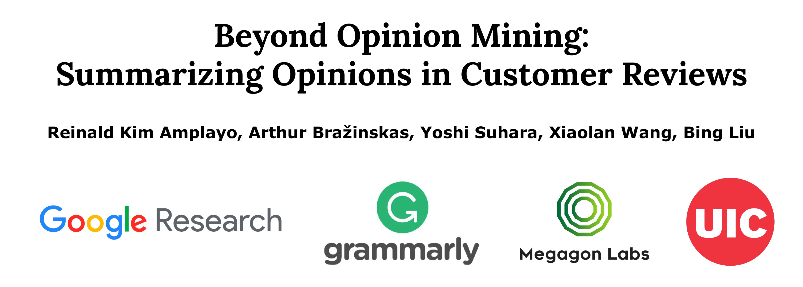

# Opinion Summarization Tutorial

This repository contains materials for the tutorial on opinion summarization, presented at [SIGIR 2022](https://arxiv.org/abs/2206.01543), Madrid, the 7th of July.

## Content

| Section                       | Slides | Video  |
| ----------------------------- |:-------------:| :-----:|
| Introduction                  | [Download](https://abrazinskas.s3.eu-west-1.amazonaws.com/downloads/slides/opinion_summ_tutorial/introduction.pdf) | - |
| Autoencoders                  | [Download](https://abrazinskas.s3.eu-west-1.amazonaws.com/downloads/slides/opinion_summ_tutorial/autoencoders.pdf) | - |
| Synthetic Datasets            | [Download](https://abrazinskas.s3.eu-west-1.amazonaws.com/downloads/slides/opinion_summ_tutorial/synthetic.pdf) | - |
| Low-resource Learning         | [Download](https://abrazinskas.s3.eu-west-1.amazonaws.com/downloads/slides/opinion_summ_tutorial/lr_learning.pdf) | - |
| Evaluation and Resources      | [Download](https://abrazinskas.s3.eu-west-1.amazonaws.com/downloads/slides/opinion_summ_tutorial/eval_and_resources.pdf) | - |
| Challenges and Opportunities  | [Download](https://abrazinskas.s3.eu-west-1.amazonaws.com/downloads/slides/opinion_summ_tutorial/challenges_and_opportunities.pdf) | - |

The videos will be available **soon**.

For questions, please reach me abrazinskas (at) google.com